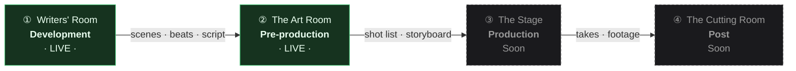
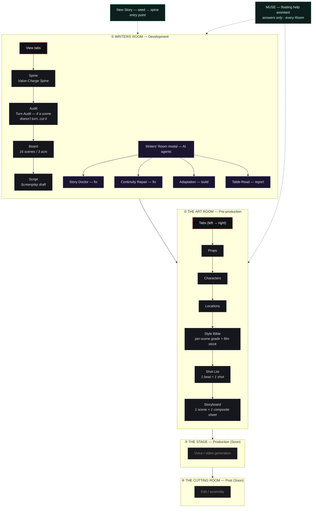
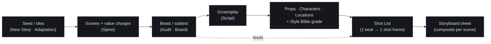

# TURN — application structure (Room → Room)

TURN is organised as a **film production pipeline**: a sequence of *Rooms*
(departments), each with its own set of in-body *view tabs*. You move through the
Rooms left-to-right, and the work product of one Room feeds the next
(Writers' beats → Art Room shots → Storyboard sheets → …).

- Rooms are defined in [`app/chrome.jsx`](../app/chrome.jsx) (`ROOMS`), the switcher lives in the top bar.
- A Room's view tabs render as a full-width bar under the top bar (`ViewNav`).
- **MUSE** (the help assistant) and **New Story** (seed → spine) are cross-cutting — available in every Room.

---

## 1. The pipeline at a glance

---

## 2. Inside each Room (views / tabs)

---

## 3. How the work flows (data lineage)

**Key dependencies**
- A **scene** carries open/close *value + charge* — the Spine graph and the per-film colour script ride on this.
- A **beat** becomes exactly **one shot** in the Shot List; the Shot List frame composes Style-Bible grade + location plate + character/prop sheets.
- The **Storyboard** turns each scene into **one composite sheet** (GPT Image 2, the "Cinematic Storyboard Grid"), pulling beats + shot grammar + the locked cast/location.

---

## 4. Source map

| Concern | File |
|---|---|
| Rooms + top bar + view tabs | `app/chrome.jsx` (`ROOMS`, `RoomSwitcher`, `ViewNav`) |
| App state + composition (room/view/artView) | `app/app.jsx` |
| Art Room shell + tab list | `app/artroom.jsx` (`ART_TABS`) |
| Writers' views | `app/spine.jsx`, `app/inspector.jsx`, `app/script.jsx` |
| Art tabs | `app/props.jsx`, `app/character.jsx`, `app/locations*.jsx`, `app/stylebible*.jsx`, `app/shots*.jsx`, `app/storyboard.jsx` |
| AI agents (Writers' Room modal) | `app/agents.jsx`, `app/agents-ui.jsx` |
| MUSE help assistant | `app/muse.jsx`, `app/ai.jsx` (`museSystemPrompt`, `APP_FEATURES`) |
| Sample film data | `app/story-data.jsx` |
